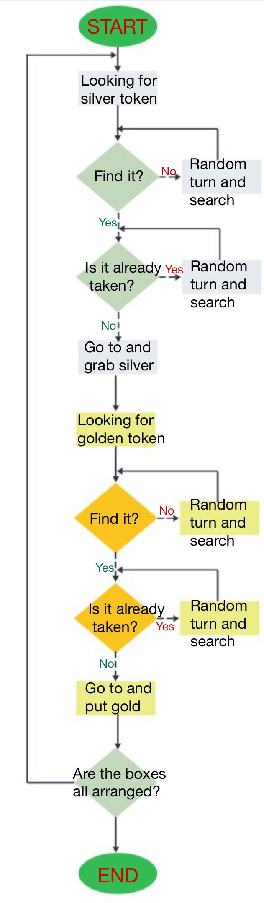

# RT1-FirstAssignment
Python Robotics Simulator
================================

This is a simple, portable robot simulator developed by [Student Robotics](https://studentrobotics.org).
Some of the arenas and the exercises have been modified for the Research Track I course

Installing and running
----------------------

The simulator requires a Python 2.7 installation, the [pygame](http://pygame.org/) library, [PyPyBox2D](https://pypi.python.org/pypi/pypybox2d/2.1-r331), and [PyYAML](https://pypi.python.org/pypi/PyYAML/).

Pygame, unfortunately, can be tricky (though [not impossible](http://askubuntu.com/q/312767)) to install in virtual environments. If you are using `pip`, you might try `pip install hg+https://bitbucket.org/pygame/pygame`, or you could use your operating system's package manager. Windows users could use [Portable Python](http://portablepython.com/). PyPyBox2D and PyYAML are more forgiving, and should install just fine using `pip` or `easy_install`.

## Troubleshooting

When running `python run.py <file>`, you may be presented with an error: `ImportError: No module named 'robot'`. This may be due to a conflict between sr.tools and sr.robot. To resolve, symlink simulator/sr/robot to the location of sr.tools.

On Ubuntu, this can be accomplished by:
* Find the location of srtools: `pip show sr.tools`
* Get the location. In my case this was `/usr/local/lib/python2.7/dist-packages`
* Create symlink: `ln -s path/to/simulator/sr/robot /usr/local/lib/python2.7/dist-packages/sr/`

## Exercise
-----------------------------

To run one or more scripts in the simulator, use `run.py`, passing it the file names. 

I am proposing you three exercises, with an increasing level of difficulty.
The instruction for the three exercises can be found inside the .py files (exercise1.py, exercise2.py, exercise3.py).

When done, you can run the program with:

```bash
$ python run.py exercise1.py
```

You have also the solutions of the exercises (folder solutions)

```bash
$ python run.py solutions/exercise1_solution.py
```

Program Logic
---------
This is a simple python node that lets a robot find a silver box in the environment, and put this silver box close to a golden box.
The code is symmetrical as regards the part of the silver box and the gold box, and is logically divided as follows:
 - looking for a silver token: find it?
 	- if no: random turn and search (until yes)
 	- if yes: checking if the box is already taken. Is it?
 		- if yes: random turn and search (until no)
 		- if no: go to and grab silver
The simmetrical part for the golden box:
 - looking for a golden token: find it?
 	- if no: random turn and search (until yes)
 	- if yes: checking if the box is already paired. Is it?
 		- if yes: random turn and search (until no)
 		- if no: go to and put gold
At this point, the program checks if all the token are already paired: if yes, it ends the program; if no, it begins an other loop.

The "looking for a silver/golden token" it's composed to a find_token_silver and find_token_gold functions: 
they simply use the R.see() function and looking for silver/golden boxes.
If they doesn't find any token, they do some random movement and then look for the token with the "random_turn_and_search" functions (there is one for the silver token, and an other one for the golden).
For checking if the box is already taken we use two different arrays where we collect all the silver and golden taken already paired. 
If the robot sees a token that is already collect in the array, it uses the "random_turn_and_search" function for searching an other one.
So, the last step is different for the two types of token:
 - for the silver one: the robot allign itself with the token, it reaches it with a high velocity and then it uses a lower velocity to approach and grab the token;
 - for the golden one: the robot allign itself with the token, it reaches it with a high velocity and then it uses a lower velocity to put the silver token close to the golden one.
 


Robot API
---------

The API for controlling a simulated robot is designed to be as similar as possible to the [SR API][sr-api].

### Motors ###

The simulated robot has two motors configured for skid steering, connected to a two-output [Motor Board](https://studentrobotics.org/docs/kit/motor_board). The left motor is connected to output `0` and the right motor to output `1`.

The Motor Board API is identical to [that of the SR API](https://studentrobotics.org/docs/programming/sr/motors/), except that motor boards cannot be addressed by serial number. So, to turn on the spot at one quarter of full power, one might write the following:

```python
R.motors[0].m0.power = 25
R.motors[0].m1.power = -25
```

### The Grabber ###

The robot is equipped with a grabber, capable of picking up a token which is in front of the robot and within 0.4 metres of the robot's centre. To pick up a token, call the `R.grab` method:

```python
success = R.grab()
```

The `R.grab` function returns `True` if a token was successfully picked up, or `False` otherwise. If the robot is already holding a token, it will throw an `AlreadyHoldingSomethingException`.

To drop the token, call the `R.release` method.

Cable-tie flails are not implemented.

### Vision ###

To help the robot find tokens and navigate, each token has markers stuck to it, as does each wall. The `R.see` method returns a list of all the markers the robot can see, as `Marker` objects. The robot can only see markers which it is facing towards.

Each `Marker` object has the following attributes:

* `info`: a `MarkerInfo` object describing the marker itself. Has the following attributes:
  * `code`: the numeric code of the marker.
  * `marker_type`: the type of object the marker is attached to (either `MARKER_TOKEN_GOLD`, `MARKER_TOKEN_SILVER` or `MARKER_ARENA`).
  * `offset`: offset of the numeric code of the marker from the lowest numbered marker of its type. For example, token number 3 has the code 43, but offset 3.
  * `size`: the size that the marker would be in the real game, for compatibility with the SR API.
* `centre`: the location of the marker in polar coordinates, as a `PolarCoord` object. Has the following attributes:
  * `length`: the distance from the centre of the robot to the object (in metres).
  * `rot_y`: rotation about the Y axis in degrees.
* `dist`: an alias for `centre.length`
* `res`: the value of the `res` parameter of `R.see`, for compatibility with the SR API.
* `rot_y`: an alias for `centre.rot_y`
* `timestamp`: the time at which the marker was seen (when `R.see` was called).

For example, the following code lists all of the markers the robot can see:

```python
markers = R.see()
print "I can see", len(markers), "markers:"

for m in markers:
    if m.info.marker_type in (MARKER_TOKEN_GOLD, MARKER_TOKEN_SILVER):
        print " - Token {0} is {1} metres away".format( m.info.offset, m.dist )
    elif m.info.marker_type == MARKER_ARENA:
        print " - Arena marker {0} is {1} metres away".format( m.info.offset, m.dist )
```

[sr-api]: https://studentrobotics.org/docs/programming/sr/

### The added functions ###
-----------------------------
 - drive(speed, seconds):  Function for setting a linear velocity  
                           Args:  speed (int): the speed of the wheels; seconds (int): the time interval  

 - turn(speed, seconds):  Function for setting an angular velocity  
                          Args:  speed (int): the speed of the wheels; seconds (int): the time interval

 - find_token_silver():  Function for finding the closest silver token  
                         Returns:  dist (float): distance of the closest token (-1 if no token is detected); rot_y (float): angle between the robot and the token (-1 if no token is detected); code: id of the token

 - find_token_gold():  Function for finding the closest golden token  
                       Returns:  dist (float): distance of the closest token (-1 if no token is detected); rot_y (float): angle between the robot and the token (-1 if no token is detected); code: id of the token
                                                                                 
 - dist_of_token(code, color):  Function for knowing the current distance of the token  
                                Args:  code: id of the token; color: silver/golden (because we have some token with the same code but different color)  
                                Returns:  dist (float): ditance of the token with that particular code and color

 - goto_and_grab_silver(dist, rot_y, code):  Function for reach and grab the silver token  
                                             Args:  dist (float): distance of the token; rot_y (float): angle between the robot and the token; code: id of the token  
                                             Returns:  if we are close to the token, we grab it; if the robot is well aligned with the token, we go forward; if the robot is not well aligned with the token, we move it on the left or on the right;
                                             
 - goto_and_put_gold(dist, rot_y, code):  Function for reach and put the golden token  
                                          Args:  dist (float): distance of the token; rot_y (float): angle between the robot and the token; code: id of the token  
                                          Returns:  if we are close to the token, we put it; if the robot is well aligned with the token, we go forward; if the robot is not well aligned with the token, we move it on the left or on the right;

 - check_if_inside(code, color):  Function for checking if the token is already taken    
                                  Args:  code: id of the token; color: silver/golden (because we have some token with the same code but different color)
                                  Returns:  false if the marker is already taken/put; true if the marker is not already taken/put, or if it's the first token beeing taken/put

 - random_turn_and_search_s():  Function for random turning and driving: after that, it calls the "find_token_silver()" function  
                                Returns:  dist (float): distance of the closest token (-1 if no token is detected); rot_y (float): angle between the robot and the token (-1 if no token is detected); code: id of the token 

 - random_turn_and_search_g():  Function for random turning and driving: after that, it calls the "find_token_gold()" function  
                                Returns:  dist (float): distance of the closest token (-1 if no token is detected); rot_y (float): angle between the robot and the token (-1 if no token is detected); code: id of the token 

 - golden(dist, rot_y, code):  Function that combine all the functions relates to the golden token..   
                              (goto_and_grab_silver(dist, rot_y, code), find_token_gold(), random_turn_and_search_g(), check_if_inside(code,"gold"), goto_and_put_gold(dist, rot_y, code)  
                               Args:  dist (float): distance of the token; rot_y (float): angle between the robot and the token; code: id of the token
